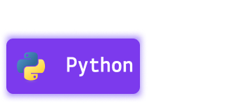

Это русская версия. Используйте её для перехода к основным репозиториям.

## Визуальная структура

	
	
	
-----------------------------------------------------------------

	 

    
    
-----------------------------------------------------------------

     
<!-- 

     -->

## Основные репозитории

### Frontend Projects

Интерфейсы, лендинги и UI-работы.

- [Frontend Projects Repo](https://github.com/YOUR-USERNAME/frontend-projects)
- [Repo README](https://github.com/devonicCEO/frontend-projects#readme)

### Cyber Security Tools Projects

Инструменты кибербезопасности, написанные на Python.

- [Cyber Security Tools Projects Repo](https://github.com/devonicCEO/cyber-security-tools)
- [Repo README](https://github.com/devonicCEO/cyber-security-tools#readme)

### Python Projects

Python ile yazılmış projeleri burada bulabilirsiniz.

- [iOS Apps Repo](https://github.com/devonicCEO/Python-Projects)
- [Repo README](https://github.com/devonicCEO/Python-Projects#readme)

<!-- ### Другие репозитории -->

<!-- - [Design Systems Repo](https://github.com/YOUR-USERNAME/design-systems) -->
<!-- - [Experiment Lab Repo](https://github.com/YOUR-USERNAME/experiment-lab) -->
